# Diagramme de Cas d'Utilisation UML - KobeTii

## Vue d'Ensemble du Système

Le système KobeTii est une plateforme complète de gestion de restaurants avec 8 types d'acteurs principaux et plus de 60 cas d'utilisation organisés en 13 domaines fonctionnels.

---

## Diagramme Complet (Format Mermaid)

```mermaid
graph TB
    %% ========================================
    %% ACTEURS
    %% ========================================
    
    SuperAdmin[👤 Super Admin]
    Owner[👤 Propriétaire]
    Manager[👤 Manager]
    Chef[👤 Chef]
    Server[👤 Serveur]
    Accountant[👤 Comptable]
    Customer[👤 Client]
    Delivery[👤 Livreur]
    
    %% ========================================
    %% GESTION UTILISATEURS ET AUTHENTIFICATION
    %% ========================================
    
    subgraph Auth["🔐 Authentification"]
        UC001[S'inscrire]
        UC002[Se connecter]
        UC003[Se déconnecter]
        UC004[Réinitialiser mot de passe]
        UC005[Gérer son profil]
    end
    
    %% ========================================
    %% GESTION SUPER ADMIN
    %% ========================================
    
    subgraph SuperAdminMgmt["⚡ Gestion Super Admin"]
        UC010[Gérer tous les restaurants]
        UC011[Gérer les abonnements]
        UC012[Suspendre un restaurant]
        UC013[Voir les statistiques globales]
        UC014[Gérer les réclamations]
        UC015[Voir historique connexions]
        UC016[Révoquer accès super admin]
    end
    
    %% ========================================
    %% GESTION RESTAURANT
    %% ========================================
    
    subgraph RestaurantMgmt["🏪 Gestion Restaurant"]
        UC020[Créer un restaurant]
        UC021[Modifier informations restaurant]
        UC022[Configurer horaires d'ouverture]
        UC023[Gérer logo et images]
        UC024[Voir statistiques restaurant]
    end
    
    %% ========================================
    %% GESTION ABONNEMENTS
    %% ========================================
    
    subgraph SubscriptionMgmt["💳 Gestion Abonnements"]
        UC030[Consulter plans disponibles]
        UC031[Souscrire à un abonnement]
        UC032[Changer de plan]
        UC033[Voir historique abonnements]
        UC034[Gérer paiements]
    end
    
    %% ========================================
    %% GESTION TABLES ET RÉSERVATIONS
    %% ========================================
    
    subgraph TableReservation["🪑 Tables et Réservations"]
        UC040[Gérer les tables]
        UC041[Voir plan de salle]
        UC042[Modifier statut table]
        UC043[Créer une réservation]
        UC044[Confirmer réservation]
        UC045[Annuler réservation]
        UC046[Voir réservations du jour]
        UC047[Marquer no-show]
    end
    
    %% ========================================
    %% GESTION MENU
    %% ========================================
    
    subgraph MenuMgmt["📋 Gestion Menu"]
        UC050[Créer catégorie menu]
        UC051[Modifier catégorie]
        UC052[Ajouter plat]
        UC053[Modifier plat]
        UC054[Définir prix]
        UC055[Gérer disponibilité plat]
        UC056[Ajouter photo plat]
        UC057[Gérer allergènes]
        UC058[Consulter menu]
    end
    
    %% ========================================
    %% GESTION COMMANDES (POS)
    %% ========================================
    
    subgraph OrderMgmt["🛒 Gestion Commandes"]
        UC060[Créer commande]
        UC061[Ajouter articles]
        UC062[Modifier commande]
        UC063[Voir commandes en cours]
        UC064[Changer statut commande]
        UC065[Préparer commande]
        UC066[Servir commande]
        UC067[Encaisser commande]
        UC068[Annuler commande]
        UC069[Voir historique commandes]
    end
    
    %% ========================================
    %% GESTION STOCK
    %% ========================================
    
    subgraph StockMgmt["📦 Gestion Stock"]
        UC070[Ajouter article stock]
        UC071[Modifier article stock]
        UC072[Enregistrer entrée stock]
        UC073[Enregistrer sortie stock]
        UC074[Voir alertes stock faible]
        UC075[Gérer fournisseurs]
        UC076[Voir historique mouvements]
    end
    
    %% ========================================
    %% GESTION PERSONNEL
    %% ========================================
    
    subgraph StaffMgmt["👥 Gestion Personnel"]
        UC080[Ajouter membre personnel]
        UC081[Modifier membre personnel]
        UC082[Désactiver membre]
        UC083[Créer planning]
        UC084[Modifier planning]
        UC085[Voir planning]
        UC086[Gérer congés]
    end
    
    %% ========================================
    %% GESTION CLIENTS ET FIDÉLITÉ
    %% ========================================
    
    subgraph CustomerLoyalty["⭐ Clients et Fidélité"]
        UC090[Créer compte client]
        UC091[Consulter profil fidélité]
        UC092[Voir points fidélité]
        UC093[Utiliser points]
        UC094[Créer offre promotionnelle]
        UC095[Gérer offres]
        UC096[Voir historique visites]
    end
    
    %% ========================================
    %% GESTION LIVRAISON
    %% ========================================
    
    subgraph DeliveryMgmt["🚚 Gestion Livraison"]
        UC100[Passer commande livraison]
        UC101[Gérer adresses livraison]
        UC102[Ajouter livreur]
        UC103[Assigner livreur à commande]
        UC104[Voir position livreur]
        UC105[Mettre à jour statut livraison]
        UC106[Voir trajet livraison]
        UC107[Confirmer livraison]
    end
    
    %% ========================================
    %% GESTION RÉCLAMATIONS
    %% ========================================
    
    subgraph ComplaintMgmt["📢 Gestion Réclamations"]
        UC110[Soumettre réclamation]
        UC111[Voir mes réclamations]
        UC112[Gérer réclamations]
        UC113[Répondre à réclamation]
        UC114[Résoudre réclamation]
        UC115[Voir historique réclamations]
    end
    
    %% ========================================
    %% GESTION CAISSE
    %% ========================================
    
    subgraph CashMgmt["💰 Gestion Caisse"]
        UC120[Ouvrir caisse]
        UC121[Enregistrer vente]
        UC122[Fermer caisse]
        UC123[Voir rapport caisse]
        UC124[Gérer écarts caisse]
    end
    
    %% ========================================
    %% RAPPORTS ET STATISTIQUES
    %% ========================================
    
    subgraph Reports["📊 Rapports et Statistiques"]
        UC130[Voir tableau de bord]
        UC131[Voir rapport ventes]
        UC132[Voir rapport financier]
        UC133[Voir plats populaires]
        UC134[Voir heures de pointe]
        UC135[Exporter rapports]
    end
    
    %% ========================================
    %% RELATIONS SUPER ADMIN
    %% ========================================
    
    SuperAdmin --> UC010
    SuperAdmin --> UC011
    SuperAdmin --> UC012
    SuperAdmin --> UC013
    SuperAdmin --> UC014
    SuperAdmin --> UC015
    SuperAdmin --> UC016
    
    %% ========================================
    %% RELATIONS PROPRIÉTAIRE
    %% ========================================
    
    Owner --> UC001
    Owner --> UC002
    Owner --> UC003
    Owner --> UC004
    Owner --> UC005
    Owner --> UC020
    Owner --> UC021
    Owner --> UC022
    Owner --> UC023
    Owner --> UC024
    Owner --> UC030
    Owner --> UC031
    Owner --> UC032
    Owner --> UC033
    Owner --> UC034
    Owner --> UC040
    Owner --> UC041
    Owner --> UC043
    Owner --> UC044
    Owner --> UC045
    Owner --> UC046
    Owner --> UC050
    Owner --> UC051
    Owner --> UC052
    Owner --> UC053
    Owner --> UC054
    Owner --> UC055
    Owner --> UC056
    Owner --> UC057
    Owner --> UC060
    Owner --> UC069
    Owner --> UC070
    Owner --> UC071
    Owner --> UC074
    Owner --> UC075
    Owner --> UC076
    Owner --> UC080
    Owner --> UC081
    Owner --> UC082
    Owner --> UC083
    Owner --> UC084
    Owner --> UC085
    Owner --> UC086
    Owner --> UC090
    Owner --> UC094
    Owner --> UC095
    Owner --> UC096
    Owner --> UC102
    Owner --> UC103
    Owner --> UC112
    Owner --> UC113
    Owner --> UC114
    Owner --> UC115
    Owner --> UC120
    Owner --> UC122
    Owner --> UC123
    Owner --> UC124
    Owner --> UC130
    Owner --> UC131
    Owner --> UC132
    Owner --> UC133
    Owner --> UC134
    Owner --> UC135
    
    %% ========================================
    %% RELATIONS MANAGER
    %% ========================================
    
    Manager --> UC001
    Manager --> UC002
    Manager --> UC003
    Manager --> UC004
    Manager --> UC005
    Manager --> UC024
    Manager --> UC040
    Manager --> UC041
    Manager --> UC042
    Manager --> UC043
    Manager --> UC044
    Manager --> UC045
    Manager --> UC046
    Manager --> UC047
    Manager --> UC050
    Manager --> UC051
    Manager --> UC052
    Manager --> UC053
    Manager --> UC054
    Manager --> UC055
    Manager --> UC056
    Manager --> UC057
    Manager --> UC060
    Manager --> UC061
    Manager --> UC062
    Manager --> UC063
    Manager --> UC064
    Manager --> UC068
    Manager --> UC069
    Manager --> UC070
    Manager --> UC071
    Manager --> UC072
    Manager --> UC073
    Manager --> UC074
    Manager --> UC075
    Manager --> UC076
    Manager --> UC080
    Manager --> UC081
    Manager --> UC082
    Manager --> UC083
    Manager --> UC084
    Manager --> UC085
    Manager --> UC086
    Manager --> UC090
    Manager --> UC094
    Manager --> UC095
    Manager --> UC096
    Manager --> UC102
    Manager --> UC103
    Manager --> UC112
    Manager --> UC113
    Manager --> UC114
    Manager --> UC115
    Manager --> UC120
    Manager --> UC121
    Manager --> UC122
    Manager --> UC123
    Manager --> UC124
    Manager --> UC130
    Manager --> UC131
    Manager --> UC132
    Manager --> UC133
    Manager --> UC134
    Manager --> UC135
    
    %% ========================================
    %% RELATIONS CHEF
    %% ========================================
    
    Chef --> UC001
    Chef --> UC002
    Chef --> UC003
    Chef --> UC004
    Chef --> UC005
    Chef --> UC052
    Chef --> UC053
    Chef --> UC055
    Chef --> UC057
    Chef --> UC058
    Chef --> UC063
    Chef --> UC064
    Chef --> UC065
    Chef --> UC070
    Chef --> UC071
    Chef --> UC072
    Chef --> UC073
    Chef --> UC074
    Chef --> UC076
    Chef --> UC085
    
    %% ========================================
    %% RELATIONS SERVEUR
    %% ========================================
    
    Server --> UC001
    Server --> UC002
    Server --> UC003
    Server --> UC004
    Server --> UC005
    Server --> UC041
    Server --> UC042
    Server --> UC043
    Server --> UC044
    Server --> UC045
    Server --> UC046
    Server --> UC058
    Server --> UC060
    Server --> UC061
    Server --> UC062
    Server --> UC063
    Server --> UC064
    Server --> UC066
    Server --> UC067
    Server --> UC068
    Server --> UC085
    Server --> UC090
    Server --> UC091
    Server --> UC092
    Server --> UC093
    Server --> UC121
    
    %% ========================================
    %% RELATIONS COMPTABLE
    %% ========================================
    
    Accountant --> UC001
    Accountant --> UC002
    Accountant --> UC003
    Accountant --> UC004
    Accountant --> UC005
    Accountant --> UC024
    Accountant --> UC069
    Accountant --> UC085
    Accountant --> UC123
    Accountant --> UC124
    Accountant --> UC130
    Accountant --> UC131
    Accountant --> UC132
    Accountant --> UC135
    
    %% ========================================
    %% RELATIONS CLIENT
    %% ========================================
    
    Customer --> UC001
    Customer --> UC002
    Customer --> UC003
    Customer --> UC004
    Customer --> UC005
    Customer --> UC043
    Customer --> UC045
    Customer --> UC058
    Customer --> UC091
    Customer --> UC092
    Customer --> UC093
    Customer --> UC100
    Customer --> UC101
    Customer --> UC104
    Customer --> UC106
    Customer --> UC110
    Customer --> UC111
    
    %% ========================================
    %% RELATIONS LIVREUR
    %% ========================================
    
    Delivery --> UC001
    Delivery --> UC002
    Delivery --> UC003
    Delivery --> UC004
    Delivery --> UC005
    Delivery --> UC063
    Delivery --> UC105
    Delivery --> UC106
    Delivery --> UC107
    
    %% Style des sous-graphes
    style Auth fill:#f0f9ff,stroke:#0ea5e9,stroke-width:2px
    style SuperAdminMgmt fill:#fef3c7,stroke:#f59e0b,stroke-width:2px
    style RestaurantMgmt fill:#fce7f3,stroke:#ec4899,stroke-width:2px
    style SubscriptionMgmt fill:#ddd6fe,stroke:#8b5cf6,stroke-width:2px
    style TableReservation fill:#d1fae5,stroke:#10b981,stroke-width:2px
    style MenuMgmt fill:#fed7aa,stroke:#f97316,stroke-width:2px
    style OrderMgmt fill:#bfdbfe,stroke:#3b82f6,stroke-width:2px
    style StockMgmt fill:#fecaca,stroke:#ef4444,stroke-width:2px
    style StaffMgmt fill:#e9d5ff,stroke:#a855f7,stroke-width:2px
    style CustomerLoyalty fill:#fef08a,stroke:#eab308,stroke-width:2px
    style DeliveryMgmt fill:#bbf7d0,stroke:#22c55e,stroke-width:2px
    style ComplaintMgmt fill:#fecdd3,stroke:#f43f5e,stroke-width:2px
    style CashMgmt fill:#d9f99d,stroke:#84cc16,stroke-width:2px
    style Reports fill:#c7d2fe,stroke:#6366f1,stroke-width:2px
```



---

## Liste Complète des Acteurs

### 1. 👤 Super Admin
**Rôle** : Administration globale de la plateforme

**Responsabilités** :
- Gérer tous les restaurants de la plateforme
- Gérer les abonnements et facturation
- Suspendre/activer des restaurants
- Voir les statistiques globales
- Gérer les réclamations de haut niveau
- Voir l'historique des connexions
- Révoquer les accès super admin

**Nombre de cas d'utilisation** : 7

---

### 2. 👤 Propriétaire (Owner)
**Rôle** : Propriétaire du restaurant, accès complet

**Responsabilités** :
- Créer et configurer le restaurant
- Gérer l'abonnement
- Gérer le menu complet
- Gérer le personnel
- Gérer les stocks
- Gérer les clients et fidélité
- Gérer les livreurs
- Voir tous les rapports
- Gérer la caisse

**Nombre de cas d'utilisation** : 60+

---

### 3. 👤 Manager (Gérant)
**Rôle** : Gestion opérationnelle quotidienne

**Responsabilités** :
- Gérer les réservations
- Gérer les commandes
- Gérer le menu
- Gérer le personnel et planning
- Gérer les stocks
- Gérer les clients
- Gérer les livreurs
- Gérer les réclamations
- Gérer la caisse
- Voir les rapports

**Nombre de cas d'utilisation** : 55+

---

### 4. 👤 Chef (Cuisine)
**Rôle** : Gestion de la cuisine et préparation

**Responsabilités** :
- Consulter et modifier le menu
- Gérer la disponibilité des plats
- Voir les commandes en cours
- Changer le statut des commandes (préparation)
- Gérer le stock des ingrédients
- Voir les alertes de stock
- Consulter son planning

**Nombre de cas d'utilisation** : 20

---

### 5. 👤 Serveur
**Rôle** : Service en salle et prise de commandes

**Responsabilités** :
- Gérer les réservations
- Voir le plan de salle
- Modifier le statut des tables
- Créer et gérer les commandes
- Servir les commandes
- Encaisser les paiements
- Gérer les clients fidélité
- Consulter son planning

**Nombre de cas d'utilisation** : 25

---

### 6. 👤 Comptable (Accountant)
**Rôle** : Gestion financière et comptabilité

**Responsabilités** :
- Voir les statistiques du restaurant
- Voir l'historique des commandes
- Gérer les rapports de caisse
- Voir les rapports financiers
- Exporter les rapports
- Consulter son planning

**Nombre de cas d'utilisation** : 12

---

### 7. 👤 Client (Customer)
**Rôle** : Utilisateur final du restaurant

**Responsabilités** :
- Créer un compte
- Consulter le menu
- Faire une réservation
- Passer une commande de livraison
- Gérer ses adresses de livraison
- Suivre sa livraison en temps réel
- Consulter ses points de fidélité
- Utiliser ses points
- Soumettre des réclamations
- Voir l'historique de ses commandes

**Nombre de cas d'utilisation** : 15

---

### 8. 👤 Livreur (Delivery)
**Rôle** : Livraison des commandes

**Responsabilités** :
- Se connecter à l'application
- Voir les commandes assignées
- Mettre à jour le statut de livraison
- Partager sa position GPS
- Voir le trajet de livraison
- Confirmer la livraison

**Nombre de cas d'utilisation** : 8

---

## Matrice Acteurs × Cas d'Utilisation

| Domaine | Super Admin | Owner | Manager | Chef | Server | Accountant | Customer | Delivery |
|---------|-------------|-------|---------|------|--------|------------|----------|----------|
| **Authentification** | ✓ | ✓ | ✓ | ✓ | ✓ | ✓ | ✓ | ✓ |
| **Gestion Super Admin** | ✓ | - | - | - | - | - | - | - |
| **Gestion Restaurant** | ✓ | ✓ | Lecture | - | - | Lecture | - | - |
| **Gestion Abonnements** | ✓ | ✓ | - | - | - | - | - | - |
| **Tables et Réservations** | - | ✓ | ✓ | - | ✓ | - | ✓ | - |
| **Gestion Menu** | - | ✓ | ✓ | Partiel | Lecture | - | Lecture | - |
| **Gestion Commandes** | - | ✓ | ✓ | Partiel | ✓ | Lecture | ✓ | Partiel |
| **Gestion Stock** | - | ✓ | ✓ | ✓ | - | - | - | - |
| **Gestion Personnel** | - | ✓ | ✓ | - | - | - | - | - |
| **Clients et Fidélité** | - | ✓ | ✓ | - | ✓ | - | ✓ | - |
| **Gestion Livraison** | - | ✓ | ✓ | - | - | - | ✓ | ✓ |
| **Gestion Réclamations** | ✓ | ✓ | ✓ | - | - | - | ✓ | - |
| **Gestion Caisse** | - | ✓ | ✓ | - | ✓ | ✓ | - | - |
| **Rapports** | ✓ | ✓ | ✓ | - | - | ✓ | - | - |

**Légende** :
- ✓ : Accès complet
- Partiel : Accès limité à certaines fonctionnalités
- Lecture : Consultation uniquement
- - : Pas d'accès

---

## Hiérarchie des Permissions

```
Super Admin (Accès global)
    │
    ├─── Owner (Accès complet restaurant)
    │       │
    │       ├─── Manager (Gestion opérationnelle)
    │       │       │
    │       │       ├─── Chef (Cuisine et stock)
    │       │       ├─── Server (Service et commandes)
    │       │       └─── Accountant (Finances)
    │       │
    │       └─── Delivery (Livraison)
    │
    └─── Customer (Utilisateur final)
```

---

## Relations entre Cas d'Utilisation

### Relations d'Inclusion (<<include>>)

1. **Créer commande** <<include>> **Authentification**
2. **Encaisser commande** <<include>> **Ouvrir caisse**
3. **Assigner livreur** <<include>> **Créer commande livraison**
4. **Utiliser points fidélité** <<include>> **Consulter profil fidélité**
5. **Exporter rapports** <<include>> **Voir rapports**

### Relations d'Extension (<<extend>>)

1. **Créer réservation** <<extend>> **Envoyer confirmation email**
2. **Fermer caisse** <<extend>> **Gérer écarts caisse**
3. **Préparer commande** <<extend>> **Alerter stock faible**
4. **Livrer commande** <<extend>> **Envoyer notification client**
5. **Résoudre réclamation** <<extend>> **Offrir compensation**

---

## Cas d'Utilisation Prioritaires

### Haute Priorité (Fonctionnalités Critiques)

1. **UC002** - Se connecter
2. **UC020** - Créer un restaurant
3. **UC031** - Souscrire à un abonnement
4. **UC052** - Ajouter plat
5. **UC060** - Créer commande
6. **UC067** - Encaisser commande
7. **UC100** - Passer commande livraison

### Moyenne Priorité (Fonctionnalités Importantes)

1. **UC043** - Créer une réservation
2. **UC070** - Ajouter article stock
3. **UC080** - Ajouter membre personnel
4. **UC090** - Créer compte client
5. **UC103** - Assigner livreur à commande
6. **UC130** - Voir tableau de bord

### Basse Priorité (Fonctionnalités Complémentaires)

1. **UC094** - Créer offre promotionnelle
2. **UC110** - Soumettre réclamation
3. **UC133** - Voir plats populaires
4. **UC135** - Exporter rapports

---

## Scénarios d'Utilisation Typiques

### Scénario 1 : Journée Type d'un Serveur

1. Se connecter (UC002)
2. Consulter son planning (UC085)
3. Voir le plan de salle (UC041)
4. Créer une réservation (UC043)
5. Créer une commande (UC060)
6. Ajouter des articles (UC061)
7. Servir la commande (UC066)
8. Encaisser (UC067)
9. Se déconnecter (UC003)

### Scénario 2 : Client Commande en Livraison

1. S'inscrire (UC001)
2. Se connecter (UC002)
3. Consulter le menu (UC058)
4. Passer commande livraison (UC100)
5. Voir position livreur (UC104)
6. Voir trajet livraison (UC106)
7. Recevoir la livraison
8. Consulter points fidélité (UC092)

### Scénario 3 : Propriétaire Configure Restaurant

1. Se connecter (UC002)
2. Créer un restaurant (UC020)
3. Souscrire à un abonnement (UC031)
4. Configurer horaires (UC022)
5. Créer catégories menu (UC050)
6. Ajouter des plats (UC052)
7. Ajouter des tables (UC040)
8. Ajouter du personnel (UC080)
9. Créer le planning (UC083)

### Scénario 4 : Manager Gère Opérations Quotidiennes

1. Se connecter (UC002)
2. Voir tableau de bord (UC130)
3. Voir réservations du jour (UC046)
4. Voir commandes en cours (UC063)
5. Gérer les réclamations (UC112)
6. Voir alertes stock faible (UC074)
7. Fermer la caisse (UC122)
8. Voir rapport ventes (UC131)

---

## Visualisation

Pour visualiser ce diagramme :

1. **En ligne** : Copiez le code Mermaid dans [Mermaid Live Editor](https://mermaid.live/)
2. **VS Code** : Installez l'extension "Markdown Preview Mermaid Support"
3. **GitHub** : Le code Mermaid est automatiquement rendu dans les fichiers .md
4. **Outils UML** : Exportez vers PlantUML, StarUML, ou Lucidchart

---

## Statistiques

- **Nombre total d'acteurs** : 8
- **Nombre total de cas d'utilisation** : 135+
- **Nombre de domaines fonctionnels** : 13
- **Relations acteurs-cas d'utilisation** : 300+

---

**Date de création** : 2026-04-27  
**Version** : v42  
**Format** : UML Use Case Diagram (Mermaid)  
**Plateforme** : KobeTii - Gestion de Restaurants
