# Diagramme de Classe UML - KobeTii

## Diagramme Complet (Format Mermaid)

```mermaid
classDiagram
    %% ========================================
    %% GESTION UTILISATEURS ET AUTHENTIFICATION
    %% ========================================
    
    class Profile {
        - id
        - email
        - phone
        - full_name
        - role
        - restaurant_id
        - avatar_url
        - username
        - created_at
        - updated_at
    }
    
    class AuthLog {
        - id
        - user_id
        - email
        - action
        - ip_address
        - user_agent
        - created_at
    }
    
    %% ========================================
    %% GESTION RESTAURANTS ET ABONNEMENTS
    %% ========================================
    
    class Restaurant {
        - id
        - name
        - slug
        - description
        - address
        - city
        - postal_code
        - phone
        - email
        - logo_url
        - cover_image_url
        - cuisine_type
        - opening_hours
        - latitude
        - longitude
        - is_active
        - visibility_score
        - rating
        - total_reviews
        - owner_id
        - created_at
        - updated_at
    }
    
    class Subscription {
        - id
        - restaurant_id
        - plan
        - status
        - user_limit
        - start_date
        - end_date
        - amount
        - currency
        - stripe_subscription_id
        - stripe_customer_id
        - created_at
        - updated_at
    }
    
    %% ========================================
    %% GESTION TABLES ET RÉSERVATIONS
    %% ========================================
    
    class Table {
        - id
        - restaurant_id
        - table_number
        - capacity
        - status
        - position_x
        - position_y
        - created_at
        - updated_at
    }
    
    class Reservation {
        - id
        - restaurant_id
        - customer_id
        - table_id
        - customer_name
        - customer_email
        - customer_phone
        - party_size
        - reservation_date
        - reservation_time
        - status
        - special_requests
        - created_at
        - updated_at
    }
    
    %% ========================================
    %% GESTION MENU
    %% ========================================
    
    class MenuCategory {
        - id
        - restaurant_id
        - name
        - description
        - display_order
        - is_active
        - created_at
        - updated_at
    }
    
    class MenuItem {
        - id
        - restaurant_id
        - category_id
        - name
        - description
        - price
        - image_url
        - allergens
        - is_available
        - preparation_time
        - created_at
        - updated_at
    }
    
    %% ========================================
    %% GESTION COMMANDES
    %% ========================================
    
    class Order {
        - id
        - restaurant_id
        - table_id
        - server_id
        - customer_id
        - delivery_person_id
        - order_number
        - status
        - order_type
        - subtotal
        - tax
        - total
        - payment_method
        - payment_status
        - delivery_status
        - delivery_address_id
        - delivery_notes
        - estimated_delivery_time
        - delivered_at
        - notes
        - created_at
        - updated_at
    }
    
    class OrderItem {
        - id
        - order_id
        - menu_item_id
        - quantity
        - unit_price
        - subtotal
        - special_instructions
        - status
        - created_at
        - updated_at
    }
    
    %% ========================================
    %% GESTION STOCK
    %% ========================================
    
    class StockItem {
        - id
        - restaurant_id
        - name
        - unit
        - quantity
        - min_quantity
        - unit_cost
        - supplier
        - last_restocked_at
        - created_at
        - updated_at
    }
    
    class StockMovement {
        - id
        - stock_item_id
        - movement_type
        - quantity
        - notes
        - created_by
        - created_at
    }
    
    %% ========================================
    %% GESTION PERSONNEL
    %% ========================================
    
    class StaffSchedule {
        - id
        - restaurant_id
        - staff_id
        - shift_date
        - start_time
        - end_time
        - role
        - status
        - notes
        - created_at
        - updated_at
    }
    
    %% ========================================
    %% GESTION CLIENTS ET FIDÉLITÉ
    %% ========================================
    
    class Customer {
        - id
        - profile_id
        - restaurant_id
        - full_name
        - email
        - phone
        - total_visits
        - total_spent
        - loyalty_points
        - created_at
        - updated_at
    }
    
    class LoyaltyTransaction {
        - id
        - customer_id
        - points
        - transaction_type
        - description
        - order_id
        - created_at
    }
    
    class Offer {
        - id
        - restaurant_id
        - title
        - description
        - discount_type
        - discount_value
        - min_points
        - valid_from
        - valid_until
        - is_active
        - created_at
        - updated_at
    }
    
    %% ========================================
    %% GESTION LIVRAISON
    %% ========================================
    
    class DeliveryAddress {
        - id
        - customer_id
        - full_name
        - phone
        - address_line1
        - address_line2
        - city
        - postal_code
        - latitude
        - longitude
        - is_default
        - created_at
        - updated_at
    }
    
    class DeliveryPersonnel {
        - id
        - restaurant_id
        - profile_id
        - full_name
        - phone
        - vehicle_type
        - vehicle_number
        - status
        - current_location
        - is_active
        - created_at
        - updated_at
    }
    
    class DeliveryLocation {
        - id
        - delivery_person_id
        - order_id
        - latitude
        - longitude
        - recorded_at
        - created_at
    }
    
    class DeliveryRoute {
        - id
        - order_id
        - start_lat
        - start_lng
        - end_lat
        - end_lng
        - geometry
        - distance_meters
        - duration_seconds
        - instructions
        - profile
        - created_at
        - updated_at
    }
    
    %% ========================================
    %% GESTION RÉCLAMATIONS ET CAISSE
    %% ========================================
    
    class Complaint {
        - id
        - restaurant_id
        - source
        - submitted_by
        - subject
        - description
        - status
        - priority
        - rating
        - admin_notes
        - resolved_at
        - created_at
        - updated_at
    }
    
    class CashRegister {
        - id
        - restaurant_id
        - opened_by
        - closed_by
        - opening_amount
        - closing_amount
        - expected_amount
        - difference
        - opened_at
        - closed_at
        - notes
    }
    
    %% ========================================
    %% RELATIONS - UTILISATEURS
    %% ========================================
    
    Profile "1" --> "*" AuthLog : génère
    Profile "*" --> "0..1" Restaurant : travaille dans
    Profile "1" --> "*" Restaurant : possède (owner)
    
    %% ========================================
    %% RELATIONS - RESTAURANT
    %% ========================================
    
    Restaurant "1" --> "*" Subscription : a
    Restaurant "1" --> "*" Table : contient
    Restaurant "1" --> "*" Reservation : reçoit
    Restaurant "1" --> "*" MenuCategory : propose
    Restaurant "1" --> "*" MenuItem : propose
    Restaurant "1" --> "*" Order : traite
    Restaurant "1" --> "*" StockItem : gère
    Restaurant "1" --> "*" StaffSchedule : planifie
    Restaurant "1" --> "*" Customer : fidélise
    Restaurant "1" --> "*" Offer : crée
    Restaurant "1" --> "*" Complaint : reçoit
    Restaurant "1" --> "*" CashRegister : utilise
    Restaurant "1" --> "*" DeliveryPersonnel : emploie
    
    %% ========================================
    %% RELATIONS - RÉSERVATIONS
    %% ========================================
    
    Profile "1" --> "*" Reservation : effectue
    Table "1" --> "*" Reservation : est réservée par
    
    %% ========================================
    %% RELATIONS - MENU
    %% ========================================
    
    MenuCategory "1" --> "*" MenuItem : contient
    
    %% ========================================
    %% RELATIONS - COMMANDES
    %% ========================================
    
    Table "0..1" --> "*" Order : accueille
    Profile "1" --> "*" Order : sert (serveur)
    Profile "1" --> "*" Order : passe (client)
    Order "1" *-- "*" OrderItem : contient
    MenuItem "1" --> "*" OrderItem : est commandé dans
    DeliveryPersonnel "0..1" --> "*" Order : livre
    DeliveryAddress "0..1" --> "*" Order : destination
    Order "1" --> "0..1" DeliveryRoute : a
    
    %% ========================================
    %% RELATIONS - STOCK
    %% ========================================
    
    StockItem "1" --> "*" StockMovement : subit
    Profile "1" --> "*" StockMovement : effectue
    
    %% ========================================
    %% RELATIONS - PERSONNEL
    %% ========================================
    
    Profile "1" --> "*" StaffSchedule : est planifié dans
    
    %% ========================================
    %% RELATIONS - CLIENTS ET FIDÉLITÉ
    %% ========================================
    
    Profile "0..1" --> "*" Customer : est lié à
    Customer "1" --> "*" LoyaltyTransaction : effectue
    Customer "1" --> "*" DeliveryAddress : possède
    Order "0..1" --> "*" LoyaltyTransaction : génère
    
    %% ========================================
    %% RELATIONS - LIVRAISON
    %% ========================================
    
    Profile "0..1" --> "*" DeliveryPersonnel : est
    DeliveryPersonnel "1" --> "*" DeliveryLocation : enregistre
    Order "0..1" --> "*" DeliveryLocation : est suivi par
    
    %% ========================================
    %% RELATIONS - RÉCLAMATIONS ET CAISSE
    %% ========================================
    
    Profile "1" --> "*" Complaint : soumet
    Profile "1" --> "*" CashRegister : ouvre
    Profile "1" --> "*" CashRegister : ferme
```

---

## Légende des Relations

### Types de Relations
- `-->` : Association simple (référence)
- `*--` : Composition (dépendance forte, cycle de vie lié)
- `o--` : Agrégation (dépendance faible)

### Cardinalités
- `1` : Exactement un
- `0..1` : Zéro ou un (optionnel)
- `*` : Zéro ou plusieurs
- `1..*` : Un ou plusieurs

---

## Organisation par Domaines

### 1. Domaine Utilisateurs (2 classes)
- Profile
- AuthLog

### 2. Domaine Restaurant (2 classes)
- Restaurant
- Subscription

### 3. Domaine Tables et Réservations (2 classes)
- Table
- Reservation

### 4. Domaine Menu (2 classes)
- MenuCategory
- MenuItem

### 5. Domaine Commandes (2 classes)
- Order
- OrderItem

### 6. Domaine Stock (2 classes)
- StockItem
- StockMovement

### 7. Domaine Personnel (1 classe)
- StaffSchedule

### 8. Domaine Clients et Fidélité (3 classes)
- Customer
- LoyaltyTransaction
- Offer

### 9. Domaine Livraison (4 classes)
- DeliveryAddress
- DeliveryPersonnel
- DeliveryLocation
- DeliveryRoute

### 10. Domaine Réclamations et Caisse (2 classes)
- Complaint
- CashRegister

---

## Relations Principales

### Restaurant comme Entité Centrale
Le restaurant est l'entité centrale du système avec des relations vers :
- Subscription (abonnement)
- Table (tables physiques)
- MenuCategory et MenuItem (menu)
- Order (commandes)
- StockItem (stock)
- StaffSchedule (planning)
- Customer (clients fidélité)
- Offer (offres promotionnelles)
- Complaint (réclamations)
- CashRegister (caisse)
- DeliveryPersonnel (livreurs)

### Profile comme Acteur Multi-Rôle
Le profil utilisateur peut être :
- Propriétaire d'un restaurant (owner)
- Membre du personnel (manager, chef, server, accountant)
- Client (customer)
- Livreur (via DeliveryPersonnel)
- Super administrateur (super_admin)

### Order comme Transaction Centrale
La commande lie plusieurs entités :
- Restaurant (où)
- Table (sur place)
- Profile (serveur et client)
- OrderItem (articles)
- DeliveryPersonnel (livreur)
- DeliveryAddress (destination)
- DeliveryRoute (trajet)
- LoyaltyTransaction (points fidélité)

---

## Notes Techniques

### Attributs Privés
Tous les attributs sont déclarés en **private (-)** conformément aux bonnes pratiques UML et à la demande.

### Types Non Spécifiés
Les types de données ne sont pas précisés dans le diagramme pour une meilleure lisibilité, conformément à la demande.

### Tailles Non Spécifiées
Les tailles des attributs (varchar, numeric, etc.) ne sont pas précisées, conformément à la demande.

### Relations Bidirectionnelles
Certaines relations sont bidirectionnelles pour refléter la navigation possible dans les deux sens :
- Profile ↔ Restaurant (travaille dans / emploie)
- Order ↔ OrderItem (contient / appartient à)
- Customer ↔ LoyaltyTransaction (effectue / concerne)

---

## Visualisation

Pour visualiser ce diagramme :

1. **En ligne** : Copiez le code Mermaid dans [Mermaid Live Editor](https://mermaid.live/)
2. **VS Code** : Installez l'extension "Markdown Preview Mermaid Support"
3. **GitHub** : Le code Mermaid est automatiquement rendu dans les fichiers .md
4. **Documentation** : Intégrez dans Docusaurus, GitBook, ou autres outils supportant Mermaid

---

**Date de création** : 2026-04-27  
**Version** : v42  
**Format** : UML Class Diagram (Mermaid)  
**Plateforme** : KobeTii - Gestion de Restaurants
